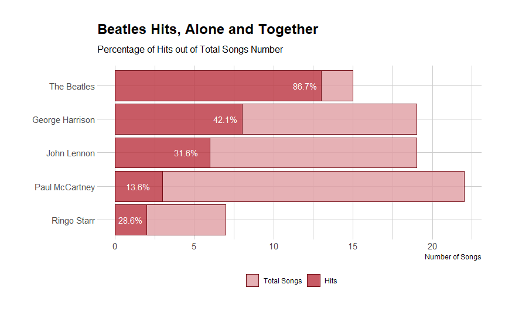

```{r child = "setup.Rmd"}
```

### Welcome

Welcome to Assignment 3 in R!

Remember:

* You can play with the assignment in Playground mode, but:
* Only your private Github repository assigned to you by the course admin will be cloned and graded (Submission mode, see instructions [here](https://github.com/DSApps-2021/Class_Slides/blob/master/Apps_of_DS_HW.pdf))
* Like any other University assignment, your work should remain private
* You need to `git clone` your private Github repository locally as explained [here](https://github.com/DSApps-2021/Class_Slides/blob/main/Apps_of_DS_HW.pdf)
* You need to uncomment the starter code inside the chunk, replace the `### YOUR CODE HERE ###`, run the chunk and see that you're getting the expected result
* Pay attention to what you're asked to do and the required output
* For example, using a *different* function than the one you were specifically asked to use, will decrease your score (unless you amaze me)
* Your notebook should run smoothly from start to end if someone presses in the RStudio toolbar Run --> Restart R and Run All Chunks
* When you're done knit the entire notebook into a html file, this is the file that would be graded
* You can add other files but do not delete any files
* Commit your work and push to your private Github repository as explained [here](https://github.com/DSApps-2021/Class_Slides/blob/main/Apps_of_DS_HW.pdf)

This assignment is due: 15/4 23:59

### Packages

These are the packages you will need. If you don't have them, you need to uncomment the `install.packages()` line and install them first (you can also just copy this command to the R console and do it there if you don't want all the output printed in this notebook).

When you load the packages you may see different kinds of messages or warnings, skim them:

```{r}
# install.packages(c("tidyverse", "ggmosaic", "glue", "tidymodels", "glmnet", "randomForest", "kernlab"))
library(tidyverse)
library(ggmosaic)
library(glue)
library(tidymodels)
library(glmnet)
library(randomForest)
library(kernlab)
```

### The `spotify_songs` Dataset

The `spotify_songs` dataset was curated by [Kaylin Pavlik](https://www.kaylinpavlik.com/author/walkerkq/) from the [`spotifyr`](https://www.rcharlie.com/spotifyr/) package. It contains about 28K songs from 6 main genres (Electronic Dance Music, Latin, Pop, RnB, Rap, Rock), where each song has:

* `track_name`
* `track_artist`
* `track_popularity`
* `track_album_name`
* `track_album_release_date`
* `playlist_genre`

As well as 12 audio features, such as `duration_ms`, `key`, `danceability`, `acousticness` and more. See full description at the [Tidy Tuesday repo](https://github.com/rfordatascience/tidytuesday/tree/master/data/2020/2020-01-21).

```{r}
spotify_songs <- read_csv('https://raw.githubusercontent.com/rfordatascience/tidytuesday/master/data/2020/2020-01-21/spotify_songs.csv')

spotify_songs %>% count(playlist_genre)
```
**Attention**: Apparently each song can repeat a few times with a few genres!

```{r}
spotify_songs %>% count(track_id, sort = TRUE)
```

You can either ignore this for now or sample a genre for each song, e.g. with:

```{r}
spotify_songs <- spotify_songs %>%
  group_by(track_id) %>%
  slice_sample(n = 1) %>%
  ungroup()
```


### Visualiztion with `ggplot2`

##### (50 points)

Take a look at [Kaylin Pavlik's post](https://www.kaylinpavlik.com/classifying-songs-genres/). Kaylin does some mean `ggplot`ing for exploratory data analysis, and there's room for more.

In this part of the assignment you will produce 5 `ggplot`s describing the data.

* You may not copy one of Kaylin's plots but you may repeat *what it is showing* in a different way
* You may even repeat your own plot showing the relation between variable X and Y, using a different `geom_`, if you think this is interesting
* You may use any `ggplot2` extension. There are countless, some may be found [here](http://www.ggplot2-exts.org/gallery/)
* Pay attention to labeling, legends, ticks - make your plots look good (but don't overdo it just because you can)

For example, this a mosaic plot of `mode` (minor/major) vs. genre, using the [`ggmosaic'](https://cran.r-project.org/web/packages/ggmosaic/vignettes/ggmosaic.html) package:

```{r}
spotify_songs %>%
  group_by(playlist_genre) %>%
  summarise(mean_modality = mean(mode)) %>%
  arrange(mean_modality) %>%
  pull(playlist_genre) -> genres_sorted_by_mode

spotify_songs %>%
  mutate(
    genre = fct_relevel(playlist_genre, genres_sorted_by_mode),
    modality = factor(ifelse(mode == 1, "Major", "Minor"))
  ) %>%
  ggplot() +
  geom_mosaic(aes(x = product(modality, genre), fill = modality), na.rm = TRUE) + 
  labs(x = "", y = "", title="Modality by Genre", caption = "Data: ~28K Spotify songs") +
  guides(fill = FALSE) +
  scale_fill_manual(values = c("#f4c2c2", "#4dc8e9")) +
  theme_bw() +
  theme(text = element_text(family = "mono"),
        axis.text = element_text(size = 12),
        plot.title = element_text(size = 18))
```

Though I'm not sure in this case the mosaic plot justifies itself, there's about the same frequency of songs for each genre.

Perhaps a better example is what a former student did. He didn't just use the entire data, he was interested in the Beatles and he told a very interesting story, showing how the Beatles together produced more hits percentage-wise, than alone:



Be that student.


### Tidy Modeling

##### (50 points)

Let's filter the songs to EDM and RnB songs only and let's recode the value "r&b" to "RnB" and "edm" to "EDM":

```{r}
spotify_songs2 <- spotify_songs %>%
  filter(playlist_genre %in% c("edm", "r&b")) %>%
  mutate(playlist_genre = recode(playlist_genre, "r&b" = "RnB", "edm" = "EDM"))
```

In this part of the assignment you will try to build a model to classify whether a song is of genre EDM or RnB, using the `tidymodels` approach.

**Attention: the goal of this part of the assignment is not to reach the best accuracy, nor is it to demonstrate fancy feature engineering, but to show you can model a dataset in a tidy way**

Start with only the 12 audio features as predictors. You can later feature engineer to death.

```{r}
# predictors <- ### YOUR CODE HERE ###

spotify_songs2 <- spotify_songs2 %>%
  select(playlist_genre, all_of(predictors))
```

Split the data into `sptfy_tr` and `sptfy_te`, the training and testing datasets, 80% for training, 20% for testing.

```{r}
set.seed(2013)

### YOUR CODE HERE ###

glue("train no. of rows: {nrow(sptfy_tr)}
     test no. of rows: {nrow(sptfy_te)}")
```

Make a `recipe()` for modeling `playlist_genre` from all predictors. Including a scaling step for all numeric variables to have mean 0 and standard deviation 1, and don't forget to `prep()` everything on the *proper* dataset:

```{r}
# sptfy_rec <- ### YOUR CODE HERE ###
```

Now `bake()` your recipe to produce the `sptfy_tr_ready` and `sptfy_te_ready` datasets:

```{r}
# sptfy_tr_ready <- ### YOUR CODE HERE ###
# sptfy_te_ready <- ### YOUR CODE HERE ###
```

Make sure the *proper* data is properly normalized.

Now build a `parsnip` classification model with `logistic_reg()`, and set the engine for "glmnet". Build two classifiers, one with Ridge-like L2 penalty of 0.001, one with Lasso-like L1 penalty of 0.001, and fit them on the `sptfy_tr_ready` dataset:

```{r}
# mod_l1 <- ### YOUR CODE HERE ###
# mod_l2 <- ### YOUR CODE HERE ###
```

Build a Random Forests `parsnip` classification model and set the engine to the "randomForest", with 100 trees, 4 variables at each split and minimum observations at leaf of 50:

```{r}
# mod_rf <- ### YOUR CODE HERE ###
```

Build a Kernel SVM `parsnip` classification model (look it up!) and set the engine to "kernlab". Use the `rbf_sigma` parameter of 0.1.

```{r}
# mod_ksvm <- ### YOUR CODE HERE ###
```

For all 4 models combined, use a similar approach to what we did in class, for creating a tidy `results_test` dataset which will hold for every observation in the `sptfy_te_ready` data the `method` used, the predicted `.pred_RnB` score of the song being of genre RnB and the `truth` label.

```{r}
# results_test <- ### YOUR CODE HERE ###
# dim(results_test)
# head(results_test)
```

Finally use the `roc_auc` function from the `yardstick` package to extract the test AUC for each model. Use the score for "RnB" and be heavily inspired from what we did in class.

```{r}
### YOUR CODE HERE ###
```

You should see AUCs of about 90% and above (does this surprise you?), if not perhaps you should review your process.

### Wrap up

And that's it, you have shown you can use `ggplot2` to create next-level visualizations and `tidymodels` to predict the genre of a song, the tidy way. Feel free to add features and properly tune the models and amaze me with higher AUCs. Good luck with the rest of the course!